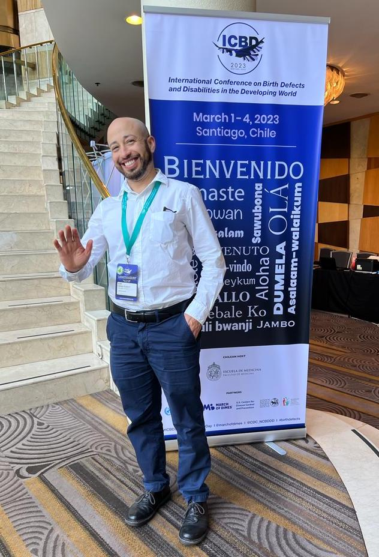

Plenary at the International Conference on Birth Defects and Disabilities in the Developing World, 2023
 

## Education
I hold a PhD from London School of Hygiene and Tropical Medicine in Epidemiology and Public Health. I previously received a MPH from Columbia University in Global Health and MA from San Francisco State University in Ethnic Studies.
